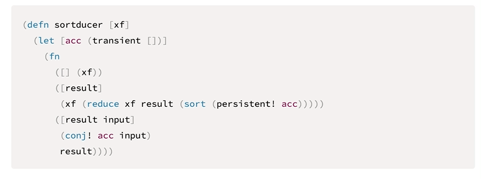

## Obsidian Plugin: Copy Code from Code Block

This small plugin adds a "copy"-button in the top right corner of code blocks.
The button remains hidden until the code block is hovered over.

Supports both light and dark themes.

## Known issues
- When unloading the addon, Obsidian must be refreshed to get rid of the copy-button, which will become unstyled
- Need to explore whitespace issues at the end of the code block
- Investigate positioning the button without adding a css-class on the code block's div-container